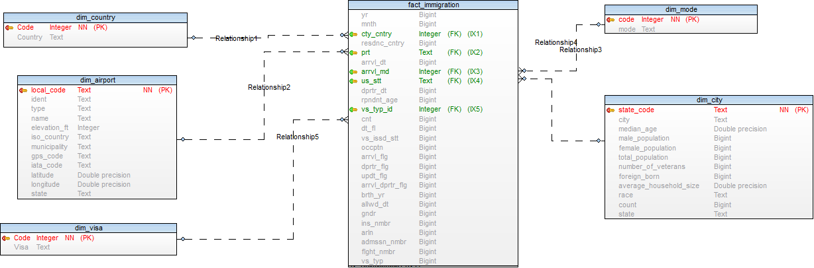

## Immigration ETL

[GitHub Repository](https://github.com/hdtahay99/etl-immigration-udacity)


For test o execute the pipeline, please run the follow code:

```
python etl.py
```

<hr>

1. Scope the project
    -

    The project is based on the creation of a fact table that can answer the relationships between the following tables that are formed to build the fact:

    - I94 Immigration Data: This data comes from the US National Tourism and Trade Office. A data dictionary is included in the workspace. This is where the data comes from. There's a sample file so you can take a look at the data in csv format before reading it all in. You do not have to use the entire dataset, just use what you need to accomplish the goal you set at the beginning of the project.

    - U.S. City Demographic Data: This data comes from OpenSoft.

    - Airport Code Table: This is a simple table of airport codes and corresponding cities.

#### Immigration Data
- I94YR - 4 digit year
- I94MON - Numeric month
- I94CIT & I94RES - This format shows all the valid and invalid codes for processing
- I94PORT - This format shows all the valid and invalid codes for processing
- ARRDATE is the Arrival Date in the USA. It is a SAS date numeric field that a 
   permament format has not been applied.  Please apply whichever date format 
   works for you.
- I94MODE - There are missing values as well as not reported (9)
- I94ADDR - There is lots of invalid codes in this variable and the list below 
   shows what we have found to be valid, everything else goes into 'other'
- DEPDATE is the Departure Date from the USA. It is a SAS date numeric field that 
   a permament format has not been applied.  Please apply whichever date format 
   works for you.
- I94BIR - Age of Respondent in Years
- I94VISA - Visa codes collapsed into three categories
- COUNT - Used for summary statistics
- DTADFILE - Character Date Field - Date added to I-94 Files - CIC does not use
- VISAPOST - Department of State where where Visa was issued - CIC does not use
- OCCUP - Occupation that will be performed in U.S. - CIC does not use
- ENTDEPA - Arrival Flag - admitted or paroled into the U.S. - CIC does not use
- ENTDEPD - Departure Flag - Departed, lost I-94 or is deceased - CIC does not use
- ENTDEPU - Update Flag - Either apprehended, overstayed, adjusted to perm residence - CIC does not use
- MATFLAG - Match flag - Match of arrival and departure records
- BIRYEAR - 4 digit year of birth
- DTADDTO - Character Date Field - Date to which admitted to U.S. (allowed to stay until) - CIC does not use
- GENDER - Non-immigrant sex
- INSNUM - INS number
- AIRLINE - Airline used to arrive in U.S.
- ADMNUM - Admission Number
- FLTNO - Flight number of Airline used to arrive in U.S.
- VISATYPE - Class of admission legally admitting the non-immigrant to temporarily stay in U.S.

2. Cleaning Steps
    -
    - all the stages were organized in csv format in the stages/ directory
    - each dimension that contains the suffix _code.csv, was obtained manually and only stored as csv, to be processed and cleaned through python
    - manually, each stage underwent the cleaning of white spaces, characters such as ",-.", in addition to carrying a data standard in uppercase
    - each null value of a string data type was replaced by "TO BE DETERMINATED" and for numeric values -1.0 or -1, to carry a standard that these data are outliers or data to be replaced by another ETL
    - everything was stored in parquet format and some dimensions and the fact were analyzed to store them, either by state, year or month, since they exceeded thousands of data.

### Datamart Immigration Model

- the model is composed of 5 dimensions, of which are related to the fact table, dimensions such as dim_visa, dim_mode, although they are short, they were decided to leave, because it is easier to maintain, than to leave them specifically in a cleaning routine, as well as those of aiport that were also added or those of city that were added instead of generating another dimension and for the columns that do not contain a value only "TO BE DETERMINATED" or "-1, -1.0" were defined for strings as numeric.
 
### Purpose of the final Model
- The purpose of the model is to obtain the relationship of the immigration data, between the ports of arrival and where the immigrants settle. In this way, characteristics can be obtained to be consumed by demographic analysis tools or in terms of analyzing the trend of people, if they move by quality, race, population, etc.


3. Model Conclusions
    - 
- The model is built through small dimensions like dim_mode, dim_visa, dim_country. Each of these dimensions was subjected to a data engineering process, to eliminate blank spaces, characters or to define the standard for data outliers. For these scenarios, pandas and spark were used for writing in parquet. There was no need to group or partition them due to the minimal amount of data.

- For the dim_airport and dim_city scenarios, these are not only made up of the main files denoted in the project context section, but also what was in the .SAS file for the I94CIT and I94PORT columns respectively. A left join was made to identify which ones already exist in the large stages and only insert the missing ones.

- The opportunity for improvements is identified, regarding the issue of when to schedule, we suggest that in any case, the fact is only an insertion/update, because it is the one that contains more records. It could also be with the dimensions in case they are increasing in data. Another issue is that the data can be loaded either daily, in case there are conflicts to obtain the data, it can be scheduled with a day of delay in case you want to consult it daily, for the cases in which it must be populated and displayed in a dashboard at 7 a.m.


4. Other scenarios and challenges
    -
- The data was increased by 100x.
    - We can use a cluster manager and increase the number of nodes depending on the needs, also we can execute the pipeline for batches of data.

- The data populates a dashboard that must be updated on a daily basis by 7am every day.
    - The ETL process should be scheduled daily, in the event that there is a lot of data, this can be scheduled in the early hours before 7 am, starting with the loads of the dimensions and then doing an insert-update to the fact table. Tools like Airflow, Talend, could support that.

- The database needed to be accessed by 100+ people.
    - You could separate or define a view that points to the main fact table, so as not to overwhelm the main server. In addition to using an administrator cluster and increasing the number of nodes for queries. Another scenario that it can support is the act of creating OLAP cubes.
